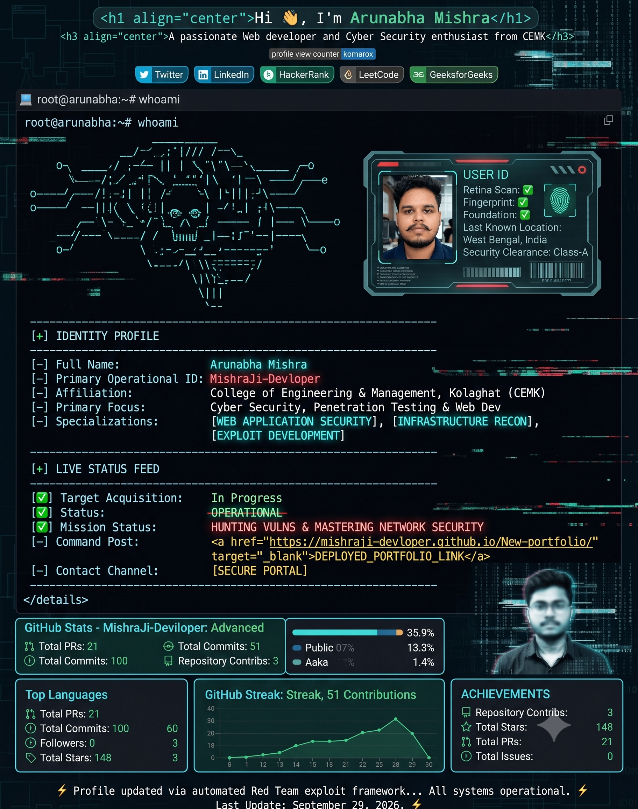

<!-- 1. The Exact Hacker HUD Card with Your Photo & ASCII Skull -->

  

<!-- Real-time Status Badges & Direct Links -->

  
  
  
  

---

### 🛡️ `root@arunabha:~# ls -la /arsenal/tools`

  
  
  
  
  
  
  
  

---

### 📊 `root@arunabha:~# systemctl status repository-telemetry`

  
  

 

  

---

### 🌐 `root@arunabha:~# netstat -an | grep CONNECT`

  
  
  
  
  

---

  ⚡ Profile updated via automated exploit framework... All systems operational ⚡

